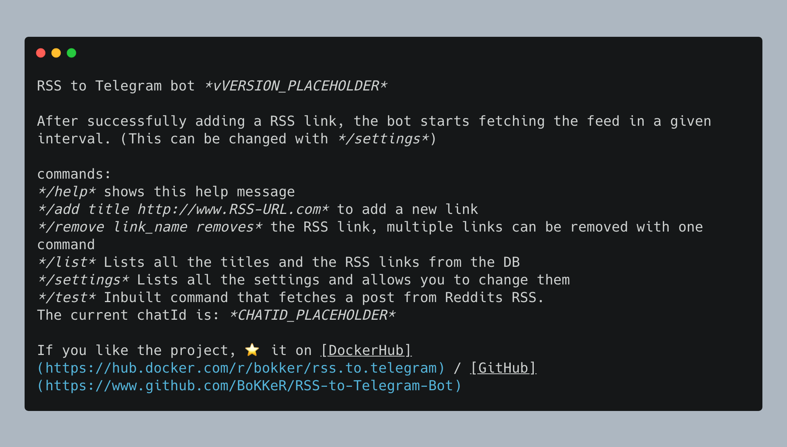

  
# RSS to Telegram bot

A self-hosted telegram JavaScript/TypeScript bot that dumps posts from RSS feeds to a telegram chat. 
This script was created because all the third party services were unreliable.


### Docker

For the docker image go to: https://hub.docker.com/r/bokker/rss.to.telegram/

### Installation

Dont forget to use the right node version. `nvm use` or match the version in `.nvmrc`

```sh
npm install
cp .env.example .env
npm run dev
```

Dont forget to fill the .env file

A telegram bot is needed that the script will connect to. https://botsfortelegram.com/project/the-bot-father/
Running the script and typing in /help will reveal the current chatId, this needs to be set also in the script

1. Clone the script
2. Save and run
3. Use the telegram commands to manage feeds

# Usage

send /help to the bot to get the following message: 



# Known issues

There are no known issues.

# Docker

```
docker create \
  --name=rss.to.telegram \
  -e TOKEN=InsertToken \
  -e DEBUG=false \
  -v /path/to/host/config:/app/config \
  --restart unless-stopped \
  bokker/rss.to.telegram
```
